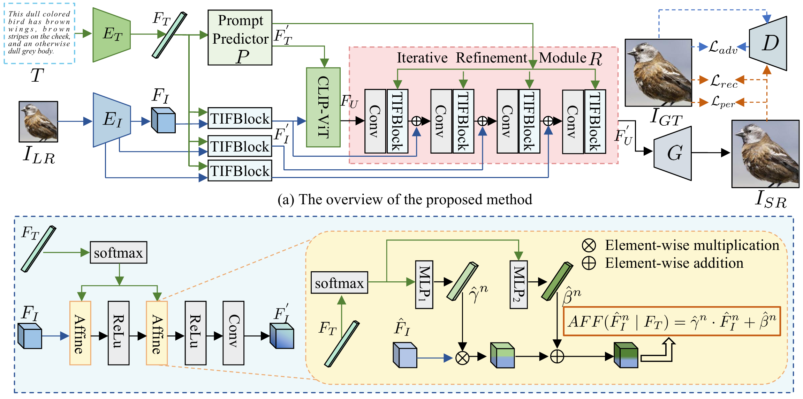

The official implementation of the IEEE TMM2025 paper: 

<div align="center">
<h1>
<b>
CLIP-SR: Collaborative Linguistic and Image Processing for Super-Resolution
</b>
</h1>
</div>


<p align="center"></p>


Convolutional Neural Networks (CNNs) have ad
vanced Image Super-Resolution (SR), but most CNN-based meth
ods rely solely on pixel-based transformations, often leading to
 artifacts and blurring, particularly with severe downsampling
 (e.g., 8× or 16×). Recent text-guided SR methods attempt to
 leverage textual information for enhanced detail, but they fre
quently struggle with effective alignment, resulting in inconsistent
 semantic coherence. To address these limitations, we introduce
 a multi-modal semantic enhancement approach that combines
 textual semantics with visual features, effectively tackling seman
tic mismatches and detail loss in highly degraded LR images.
 Our proposed multi-modal collaborative framework enables the
 production of realistic and high-quality SR images at significant
 up-scaling factors. The framework integrates text and image
 inputs, employing a prompt predictor, Text-Image Fusion Block
 (TIFBlock), and Iterative Refinement Module alongside CLIP
 (Contrastive Language-Image Pretraining) features to guide a
 progressive enhancement process with fine-grained alignment.
 This alignment produces high-resolution outputs with crisp
 details and semantic coherence, even at large scaling factors.
 Through extensive comparative experiments and ablation studies,
 we validate the effectiveness of our approach. Additionally, by
 incorporating textual semantic guidance, our technique enables a
 degree of super-resolution editability while maintaining semantic
 coherence.

> **CLIP-SR: Collaborative Linguistic and Image Processing for Super-Resolution**
>
> Bingwen Hu, Heng Liu, Zhedong Zheng, and Ping Liu
>
>
> 1 School of Computer Science and Technology, Anhui University of Technology
> 
> 2 Department of Computer Science and Engineering, Southern University of Science and Technology
> 
> 3 School of Computer Science and Information Engineering, Hefei University of Technology


## Requirements

We test the codes in the following environments; other versions may also be compatible:

- CUDA 11.6 
- Python 3.10
- Pytorch 1.11.0


## Data Preparation
Create a new directory data to store all the datasets.

1. Downlaod the Mini-Ref-YouTube-VOS dataset and Mini-Ref-SAIL-VOS dataset from the [website](https://drive.google.com/drive/folders/1ZdrQY8gKKEmMoJxP13ZZ5_Qrc4hGoZUj?usp=sharing).
2. Put the dataset in the `./data` folder.
```
data
├─ Mini-Ref-YouTube-VOS
│   ├─ meta_expressions
│   └─ train
│       ├─ Annotations
│       ├─ JPEGImages
│       └─ train.json
├─ Mini-Ref-SAIL-VOS
│   ├─ meta_expressions
│   └─ train
│       ├─ Annotations
│       ├─ JPEGImages
│       └─ train.json

```


### Training
```
./scripts/train_ytvos.sh [/path/to/output_dir] [/path/to/pretrained_weight] --backbone [backbone]  --group 1
```

### Inference & Evaluation

```
python test.py --dataset_file mini-ytvos --group 1
```


## Acknowledgement
This repo is based on [ReferFormer](https://github.com/wjn922/ReferFormer) and [DANet](https://github.com/scutpaul/DANet). Thanks for these outstanding works.

## Citation

```
@article{Heng_2025_IJCV,
  title={Few-Shot Referring Video Single- and Multi-Object Segmentation via Cross-Modal Affinity with Instance Sequence Matching},
  author={Heng Liu, Guanghui Li, Mingqi Gao, Heng Liu, Xiantong Zhen, Feng Zheng, Yang Wang},
  journal={International Journal of Computer Vision},
  year={2025}
}

@InProceedings{Li_2023_ICCV,
    author    = {Li, Guanghui and Gao, Mingqi and Liu, Heng and Zhen, Xiantong and Zheng, Feng},
    title     = {Learning Cross-Modal Affinity for Referring Video Object Segmentation Targeting Limited Samples},
    booktitle = {Proceedings of the IEEE/CVF International Conference on Computer Vision (ICCV)},
    month     = {October},
    year      = {2023},
    pages     = {2684-2693}
}
```


