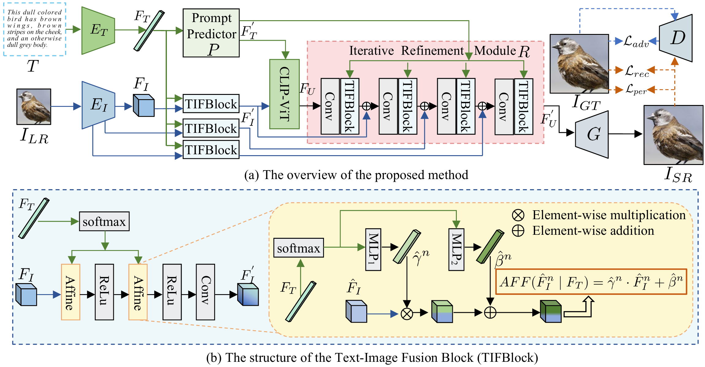
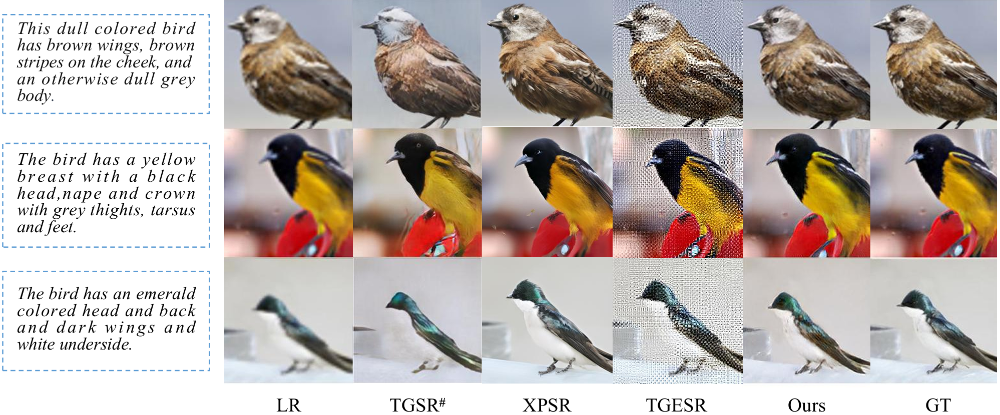
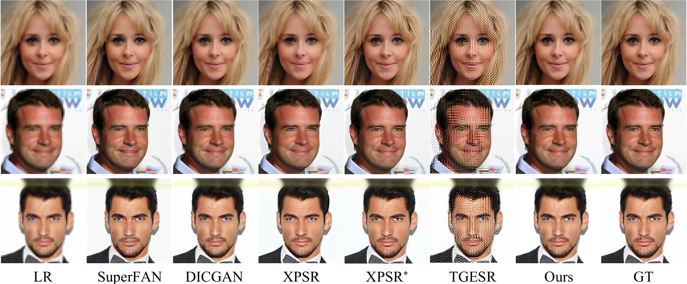

# CLIP-SR: Collaborative Linguistic and Image Processing for Super-Resolution

[Paper]([https://arxiv.org/abs/2412.11609](https://arxiv.org/abs/2412.11609))
<a href='https://arxiv.org/abs/2412.11609'></a> &nbsp;&nbsp;

Bingwen Hu<sup>1</sup> | Heng Liu*<sup>1</sup> | Zhedong Zheng<sup>2</sup> | Ping Liu<sup>3</sup> 

<sup>1</sup>School of Computer Science and Technology, Anhui University of Technology, <sup>2</sup> FST and ICI,University of Macau,<sup>3</sup> Department of Computer Science and Engineering,University of Nevada


<p align="center"></p>


Convolutional Neural Networks (CNNs) have ad
vanced Image Super-Resolution (SR), but most CNN-based meth
ods rely solely on pixel-based transformations, often leading to
 artifacts and blurring, particularly with severe downsampling
 (e.g., 8× or 16×). Recent text-guided SR methods attempt to
 leverage textual information for enhanced detail, but they fre
quently struggle with effective alignment, resulting in inconsistent
 semantic coherence. To address these limitations, we introduce
 a multi-modal semantic enhancement approach that combines
 textual semantics with visual features, effectively tackling seman
tic mismatches and detail loss in highly degraded LR images.
 Our proposed multi-modal collaborative framework enables the
 production of realistic and high-quality SR images at significant
 up-scaling factors. The framework integrates text and image
 inputs, employing a prompt predictor, Text-Image Fusion Block
 (TIFBlock), and Iterative Refinement Module alongside CLIP
 (Contrastive Language-Image Pretraining) features to guide a
 progressive enhancement process with fine-grained alignment.
 This alignment produces high-resolution outputs with crisp
 details and semantic coherence, even at large scaling factors.
 Through extensive comparative experiments and ablation studies,
 we validate the effectiveness of our approach. Additionally, by
 incorporating textual semantic guidance, our technique enables a
 degree of super-resolution editability while maintaining semantic
 coherence.


# Results

<p align="center">
  
</p>


<p align="center">
  
</p>


## Requirements

We test the codes in the following environments; other versions may also be compatible:

- CUDA 11.6 
- Python 3.10
- Pytorch 1.11.0

## Installation
```
## git clone this repository
https://github.com/hengliusky/CLIP-SR.git
cd CLIP-SR

# create an environment with python >= 3.10
conda create -n clipsr python=3.10
conda activate clipsr
pip install -r requirements.txt
```

## Inference
#### Step 1: Download the pretrained models 
- Create a new directory ``Pth`` .
- Download pretrained CLIP-SR model from [Google Drive](https://GoogleDrive/) and put them into ``Pth``.


#### Step 2: Prepare Datasets 
- Create a new directory ``dataset`` .
- Download  [Birds](https://www.kaggle.com/datasets/wenewone/cub2002011) dataset, [CelebA](https://www.kaggle.com/datasets/jessicali9530/celeba-dataset) dataset and [COCO](https://cocodataset.org/#download) dataset  from the website and put them into ``dataset``.
```
dataset
├─ Birds
│   ├─ train
│   ├─ test
│   ├─ text  
│   └─ image
├─ CelebA
│   ├─ train
│   ├─ test
│   ├─ text  
│   └─ image
├─ COCO
│   ├─ train
│   ├─ test   
│   └─ text
```

#### Step 3: Run code
```
cd ./Code/src
python test.py
```


### Train
```
cd ./Code/src
python train.py 
```


## Acknowledgement
This repo is based on [CLIP](https://github.com/openai/CLIP) , The Birds, Celeba and COCO datasets were used. We conducted a comparative experiment with [XPSR](https://github.com/qyp2000/XPSR) ,  [TGESR](https://github.com/KVGandikota/Text-guidedSR), [TGSR](https://github.com/cxm12/TGSR), [DICGAN](https://github.com/Maclory/Deep-Iterative-Collaboration), [CRAFT](https://github.com/AVC2-UESTC/CRAFT-SR/blob/main/README.md), [SD](https://github.com/CompVis/latent-diffusion), [ControlNet](https://github.com/Luis-kleinfeld/ControlNet). Thanks for these outstanding works.

## Citation

```
@article{hu2024clip,
  title={CLIP-SR: Collaborative Linguistic and Image Processing for Super-Resolution},
  author={Hu, Bingwen and Liu, Heng and Zheng, Zhedong and Liu, Ping},
  journal={arXiv preprint arXiv:2412.11609},
  year={2024}
}

```


